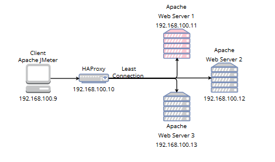

# Architecture Overview

## What is Least Connection?
HAProxy directs traffic to the server 
with the **least number of active connections**.

## Architecture Diagram



## Network Configuration Comparison

| Platform | IP Configuration |
|---|---|
| VM (VirtualBox/VMware) | Manual via Netplan |
| Killercoda | Automatic per node |
| AWS | Elastic IP / VPC |
| Azure | Virtual Network (VNet) |
| GCP | VPC Network |

## On Real VM (VirtualBox)
Static IP is configured manually using netplan:

```bash
sudo nano /etc/netplan/01-network-manager-all.yaml
```

Then apply:

```bash
sudo netplan apply
```

## On AWS
IP is assigned automatically via VPC
or manually set via Elastic IP in console.

## On This Killercoda Scenario
No IP configuration needed!
Each node already has its own IP:

| Node | Function |
|---|---|
| apache1 | Web Server 1 |
| apache2 | Web Server 2 |
| apache3 | Web Server 3 |
| haproxy | Load Balancer |
| jmeter  | Load Testing |
